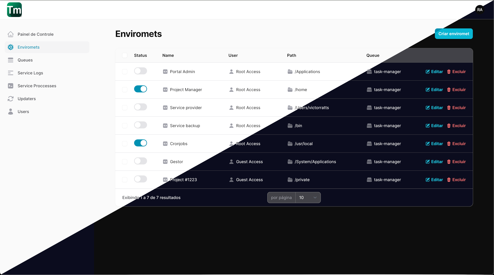

<p align="center">
<a href="#" target="_blank" style="display: flex; justify-content: center;">

<br />
<h3>Task-manager</h3>
</a>
</p>

<p align="center">


</p>

<p align="center">

</p>


## Sobre Task-Manager

Task-manager é um sistema feito em laravel para gerenciar tarefas em seu servidor. Funcionando como uma interface para ```cronjobs``` e executando tarefas em segundo planno, seja um script linux, um arquivo PHP, ou um comando especifico em seu servidor de produção, sendo possível rodar em servidores dedicados e compartilhados.

## Serviços de hospedagem testados

| serviço | provedor | status |
|---------|----------|--------|
| Hospedagem dedicada | Hostinger | ✅ |
| Hospegame Compartilhada | Hostinger | ✅ |
| Hospedagem Premium | Hostigator | ✅ |
| Hospedagem Compartilhada | Hostigator | ✅
| Hospedagem Dedicada | Digital Ocean | ✅ |

## instalação

Para efetuar a instalação é necessario ter como requisitos:

>- PHP na verão 8.2 ou superior
>- composer na versão 2.7 ou superior
>- cURL instalado
>- Banco de dados sqlite3, Mysql, Postgresql ou MongoDB

#### Passo a passo para instalação
* Clone este repositorio ou baixe em seu servidor.
* instale as dependências com composer:
```sh
composer install --no-interaction --prefer-dist --optimize-autoloader
```
* Crie um arquivo ```.env``` a partir do ```.env.example```:
```sh
cat .env.example >> .env
```
* Gere uma chave para aplicação :
```sh
php artisan key:generate
```
* Execute a migração do sistema
```sh
php artisan migrate
```

## Configurando serviços

Após a instalação, o sistema ja é acessivel atraves da url da sua instalação.
Para acessar o painel basta utilizar a rota ```/manager```. 

Contudo, o sistema ainda precisa ser configurado. Para o sistema funcionar, é necessario apontar apenas 1 cronjob para o endpoint ```/supervisor```. Desta forma, o sistema executa internamente o comando ```app:supervisor``` onde mantem os processos e serviços registrados continuamente em execução de acordo com a configuraão e intervalo inseridos.

>- NOTA: Para garantir que os serviços do Manager permaneçam sempre em execução, recomenda-se usar o instervalo de 1 minuto para o cronjob.

